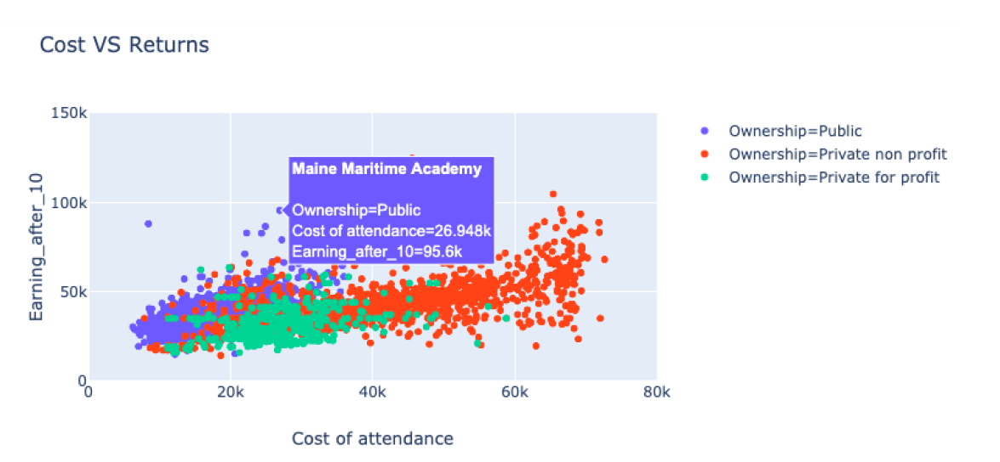
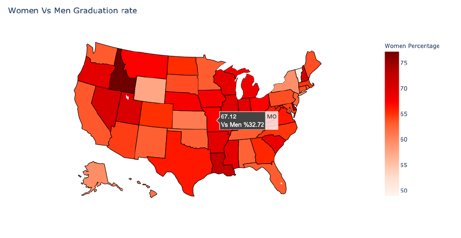
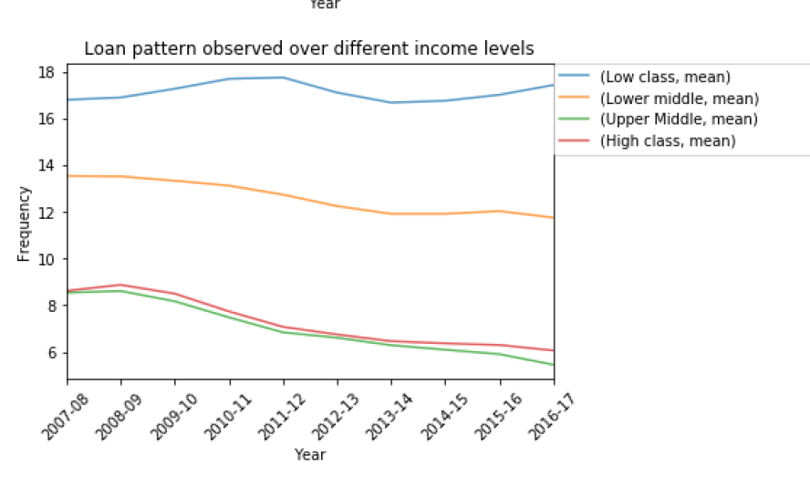

# BUDT758X-Education_Loan_Data_Analysis
Exploring the trends and patterns in the US Student debt crisis with suggestions on features that can be identified for a successful loan repayment

The libraries imported include:
    
    import pandas as pd
    import numpy as np
    import matplotlib.pyplot as plt
    import seaborn as sns
    import plotly.express as px
    import statsmodels.api as sm
    import plotly.graph_objects as go

Some important vizualisations from the project 
Vizualisation 1: Cost of Attendance by different university type 
 
Vizualisation 2: Comparison between graduation rate for males and females 
 
Vizualisation 3: Income level's effect on the loan repayment rate  
 
